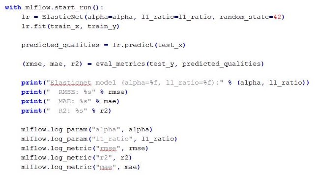
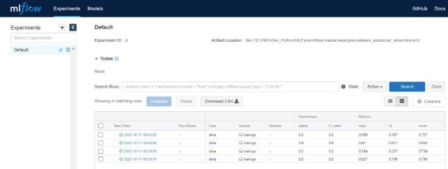
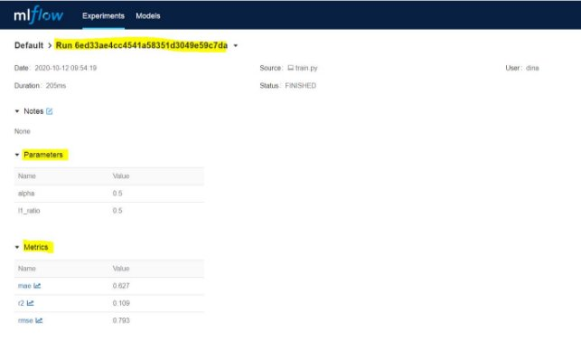
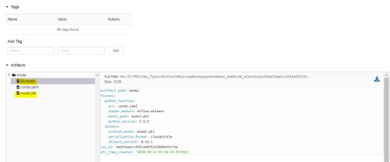
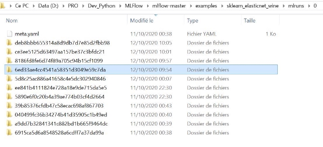
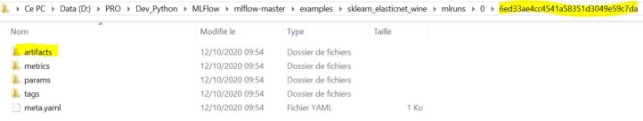
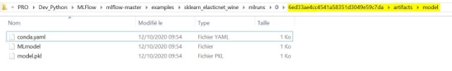
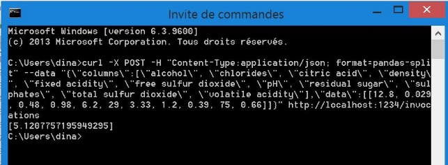

# Disease
## Team and roles: 
* Patrick SAADE (Data engineer & Data architect)
* Anthony SIAMPIRINGUE (Data Science Project Manager)

## Strate
## Users: :stethoscope:
* Medical professionals :man_health_worker:
* Clinics / hospitals :hospital:
* Medical devices or phone application :iphone:

## Usage Description: :anatomical_heart:
After providing the necessary information to the health professionals of the user or inputting his or her personal & health information on the medical device or the Web Interface.
Our model will use the the information provided by the user above to predict the disease that the user has 
After that the Web interface will display a detailed result about the patient status and possible precautions, advices to visit a professional and treatement possibilities
Our solution has a goal of diagnosing the current state of the user and providing the precautions to follow depending on the given symptoms.

## Project Management Framework
We opted to use the Waterfall framework to conduct the project because it is a software development life cycle standard and easier to apply in our team : 
we are already fully familiar with this project management framework. This approach will give us more time to focus on the tasks and less in structuring the project with other more efficients framework but needing lot of time to learn and apply it.

## Features:
Our application will feature a :
* Web interface & Data Search Interface using Streamlit
* Prediciton API using FastApi
* Machine Learning Model

## Dataset: 
* Disease, symptoms and treatement: 
https://www.kaggle.com/datasets/itachi9604/disease-symptom-description-dataset?select=Symptom-severity.csv  

## Cookie Cutter
* Structure of the project has some minor modificatios of this template : 
https://drivendata.github.io/cookiecutter-data-science/

EPITA - International Programs M2 AI Project Methodology 2021-2022 Gicen by Medina Hadjem

**Lab MLFlow**

**MLFlow Documentation**

- MLFlow Tracking**:** <https://mlflow.org/docs/latest/tracking.html>
- MLFlow Projects: <https://mlflow.org/docs/latest/projects.html>
- MLFlow Models: <https://mlflow.org/docs/latest/models.html>
- MLFlow Model Registery : <https://mlflow.org/docs/latest/model-registry.html>

**GOALS**

` `Use MLflow to:

- Train a linear regression model and track its parameters
- Package the code that trains the model in a reusable and reproducible model format
- Deploy the model into a simple HTTP server that will enable you to score predictions

**REQUIREMENTS**

Python 3.6 or later installed (you can use anaconda environment for example) Linux is preferred for this Lab.

You may need to have git installed (https://git-scm.com/downloads)

**MLFLOW INSTALLATION**

- Install MLflow :

*pip install mlflow*

- Install scikit-learn :

*pip install scikit-learn*

- You can also Install MLflow with extra dependencies, including scikit-learn :

pip install mlflow[extras]

- Install [conda](https://conda.io/projects/conda/en/latest/user-guide/install/index.html) :

*pip install conda*

- Download or Clone the MLflow repository and save it in your local working directory at : <https://github.com/mlflow/mlflow>

**MLFlow Tracking**

The MLflow tracking APIs log information about each training run, like the hyperparameters alpha and l1\_ratio, used to train the model and metrics, like the root mean square error, used to evaluate the model. The example also serializes the model in a format that MLflow knows how to deploy.

**Usage of MLFlow in the code (train.py)**

 ………

Each time you run the example, MLflow logs information about your experiment runs in the local directory **mlruns.**

- Cd to **mlruns** directory and browse throw the subdirectories **Comparing the models with MLflow UI**

Use the **MLflow UI** to compare the models that you have produced.

- In the same working directory as the one that contains the **mlruns** (examples/sklearn\_elasticnet\_wine) run:

mlflow ui

- View it at http://localhost:5000

On this page, you can see the list of your experiment runs with metrics, you can use them to compare the models.

- Use the search feature to quickly filter out many models. For example, the query **metrics.rmse < 0.8** returns all the models with root mean squared error less than 0.8. For more complex manipulations, you can download this table as a CSV and use your favorite data munging software to analyze it.
- Download CSV and take a look to it.

**Serving the Model**

Now that you have packaged your model using the MLFlow Projects convention, it’s possible to deploy the model using **MLflow Models**. An MLflow Model is a standard format for packaging machine learning models that can be used in a variety of downstream tools — for example, real-time serving through a REST API or batch inference on Apache Spark.

In the example training code (train.py), after training the linear regression model, a function in MLflow saved the model as an artifact within the run **:**

mlflow.sklearn.log\_model(lr, "model")

- To view this artifact, you can use the UI again (http://localhost:5000). When you click a date in the list of experiment runs you’ll see this page.

- We can see that the call tomlflow.sklearn.log\_model produced two files :
- The first file “MLmodel” is a metadata file that tells MLflow how to load the model.
- The second file “model.pkl” is a serialized version of the linear regression model that you trained.
- These 2 files can be found in the “mlruns” repository corresponding to the experimentation (replace the path with your model’s path):

examples\sklearn\_elasticnet\_wine\mlruns\0\6ed33ae4cc4541a58351d3049e59c 7da

You can use this MLmodel format with MLflow to deploy a local REST server that can serve predictions.

- To deploy the server, run (replace the path with your model’s path):

mlflow models serve –m mlruns\0\6ed33ae4cc4541a58351d3049e59c7da\artifacts\model -p 1234

or (if –m don’t work)

mlflow models serve –-model-uri mlruns\0\6ed33ae4cc4541a58351d3049e59c7da\artifacts\model -p 1234

Serving on **http://localhost:1234/**

Once you have deployed the server, you can pass it some sample data and see the predictions.
We also tried to automate the serving of the latest model built when querying predictions. 
The attempt weren't completely successful in running 2 subprocesses in parallel.

The following example uses curl to send a JSON-serialized pandas DataFrame with the split orientation to the model server :

**WARNING** : this command works in Bash environment but don’t work in PowerShell, use command prompt on windows .

curl -X POST http://127.0.0.1:1234/invocations -H "Content-Type:application/json; format=pandas-split" --data {'columns'=["A","B","C"], 'data'=[[1,2,3],[4,5,6]]} 

Example

For more information about the input data formats accepted by the model server, see the MLflow deployment tools documentation. <https://mlflow.org/docs/latest/models.html#local-model-deployment>

**2/More Examples**

Based on the example above, test MLflow features on another ML project (H20, Keras, XGBoost, PyToch TensorFlow….).

You can find some example projects in **mlflow-master\example**
